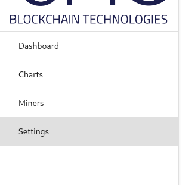
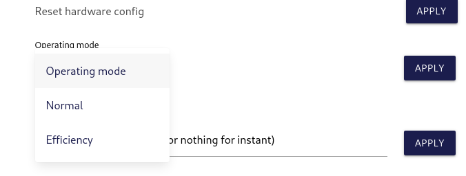
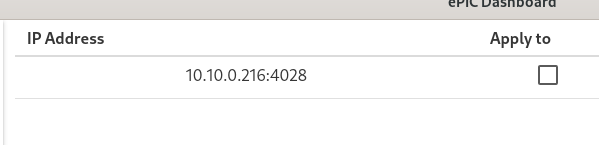

# ePIC-Miner

Please read EULA.md and PRIVACY.

# Installation guide

Download the miner image from the releases section on the sidebar to the right or from [here](https://github.com/epicblockchain/epic-miner/releases/tag/1.0.0).

## Flashing a microSD card with ePIC image

1. Download [balenaEtcher](https://www.balena.io/etcher/) for your machine.
2. Download compressed image (ePIC-SC200-vX.X.X-xxxxxxxxxx.zip)
3. Unzip image (ePIC-SC200-vX.X.X-xxxxxxxxxx.img)
4. Plug in microSD card into PC
5. Open the Etcher application as administrator or using sudo

6. Select Flash from file and choose the image file
7. Select target device
8. Flash
9. Safely remove the SD card from the machine

## Operating the miner

1. Insert the SD card into the SD card slot in the miner.
2. Turn the miner on.

## Updating the wallet address

1. Download the [epic-dashboard](https://github.com/epicblockchain/epic-dashboard) for your OS from the releases section, or build it from source.
2. Run the executable and make sure it detects your miner on your local network.

3. Click on settings and set the wallet address to your own (address.workername). (Leave password as x)

4. Click apply and use the default password of "welcome" or the password that you have set.

## Updating the operating mode

1. Click on settings.
2. Use the dropdown menu under operating mode to select the desired operating mode. If you are running on 110V use efficiency only.

3. Click apply beside operating mode.
4. Click apply and use the default password of "welcome" or the password that you have set.
5. The miner will reboot now.

## Updating the mining pool
1. Click on settings.
2. Type the address of the mining pool in the Pool text field.

3. Click apply.
4. Enter "welcome" or the password that you have set into the password field and click apply.

## Updating the password

1. Click on settings.
2. Type the new password in the new password text field.

3. Click apply.
4. Type the old password.
5. Your password will have changed to the password you entered into the new text field.

# Updating individual miners

1. Click on settings.
2. Notice that on the left side of the settings is a table with all the miners on your local network.
3. Unchecking or checking the boxes to the right of their ip addresses will remove or add them (respectively) to the set of miners the settings will be applied to.

# Things to know

* The typical process for the miner startup is to run the fan at high speed with a green light.
* The miner will flash the red and green LEDs back and forth very quickly while it calibrates.
* The miner may reboot several times on startup. This process can take up to 10 minutes.
* You will know the miner is hashing when it occasionally blinks green. Every green blink is a correct hash solution.
