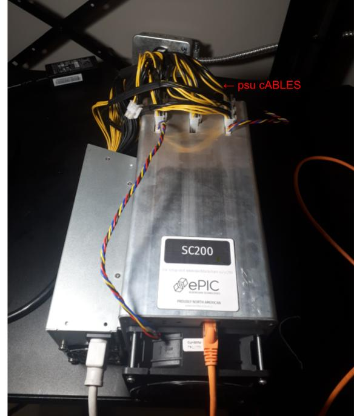

# ePIC Blockchain SC200 Miner

Please read EULA.md and PRIVACY.

# Required materials

## Included with ePIC SC200 miner

* ePIC SC200 miner
* SD card

## Not included with ePIC miner

* SD card to USB adapter
* Power supply
* Power cable
* Ethernet cable

# Installation guide

Download the miner image from the releases section on the sidebar to the right or from [here](https://github.com/epicblockchain/epic-miner/releases/).
The default password for the miner is "letmein". Please allow this miner to run on public and private networks if asked so that the software can identify miners on your network.

## Flashing a microSD card with ePIC image (SD Card comes preflashed now)

Should you need to flash the SD card with an image, follow the instructions below for the miner to operate properly.

1. Download [balenaEtcher](https://www.balena.io/etcher/) for your machine
2. Download the [compressed image](https://github.com/epicblockchain/epic-miner/releases) of the latest firmware (ePIC-SC200-vX.X.X-xxxxxxxxxx.zip)
3. Unzip the compressed image from the previous step (ePIC-SC200-vX.X.X-xxxxxxxxxx.img)
4. Plug in microSD card into PC
5. Open the Etcher application (balenaEtcher)

6. Select Flash from file and choose the image file
7. Select target device
8. Click "Flash!" and wait for the process to finish
9. Safely remove the SD card from the machine

## Inserting the SD card into the miner

1. Find the SD card slot for the miner.


2. Push the SD card into the slot until it clicks. It should have the gold coloured contacts facing up when inserted. The SD card may fall into the miner if the angle of insertion is wrong. Angle the SD card slightly up when inserting it. Wait for some resistance and then a click when pushing from the slot before releasing the chip.


## Connecting Cables

Note: The power cable must be plugged in last.

### Fan Cables

Plug in the fan cables. Face the front of the miner which has the ethernet port. The closest fan must connect to the left (when facing the miner) fan power port. The fan at the back of the miner must connect to the right (when facing the miner) fan power port.


### Ethernet Cable

Plug in the ethernet cable from your network to the fan.

### PSU Cables

Plug in the 6 pin PSU cables until they click into place.



### Power Cable

Plug in the power cable. Ensure that the fans are spinning after you plug the power in. If they are not, you may have not plugged the fans in completely.

Note: the miner will not appear on the network for up to 15 minutes. It may restart several times as it find the optimal configuration to mine at.

# Using the dashboard software

Download the dashboard software from [here](https://github.com/epicblockchain/epic-dashboard/releases/). Ensure that the dashboard file you download is the appropriate one for your operating system.
Unzip the downloaded file and double click it to run the program.

For detailed instructions on using the dashboard, read the README on the epic-dashboard github [here](https://github.com/epicblockchain/epic-dashboard/#Usage).

## SSH to the miner
Enter the following into a terminal:
```
ssh root@yourminerip
```
When prompted for a password enter the miner password, by default "letmein"
