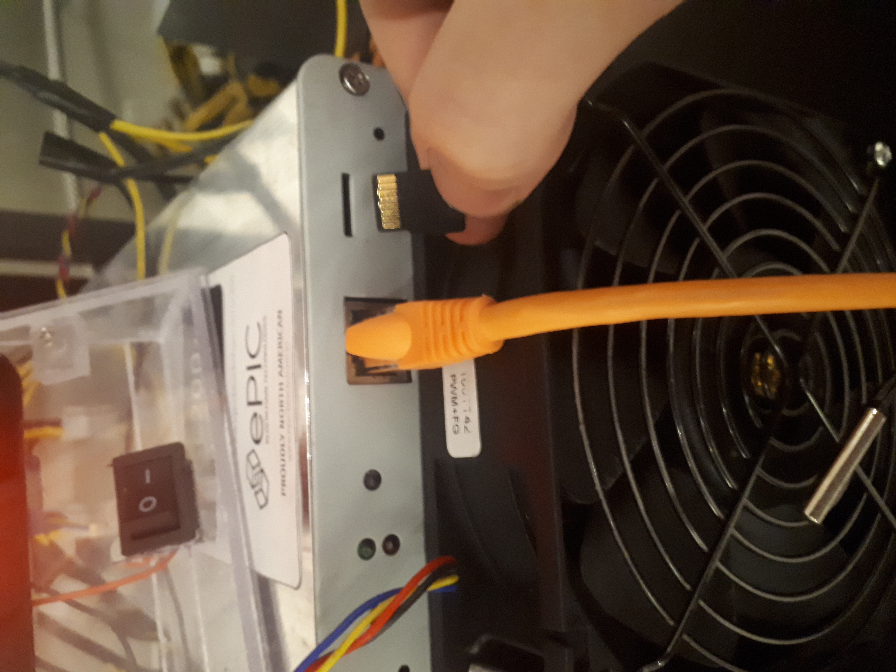
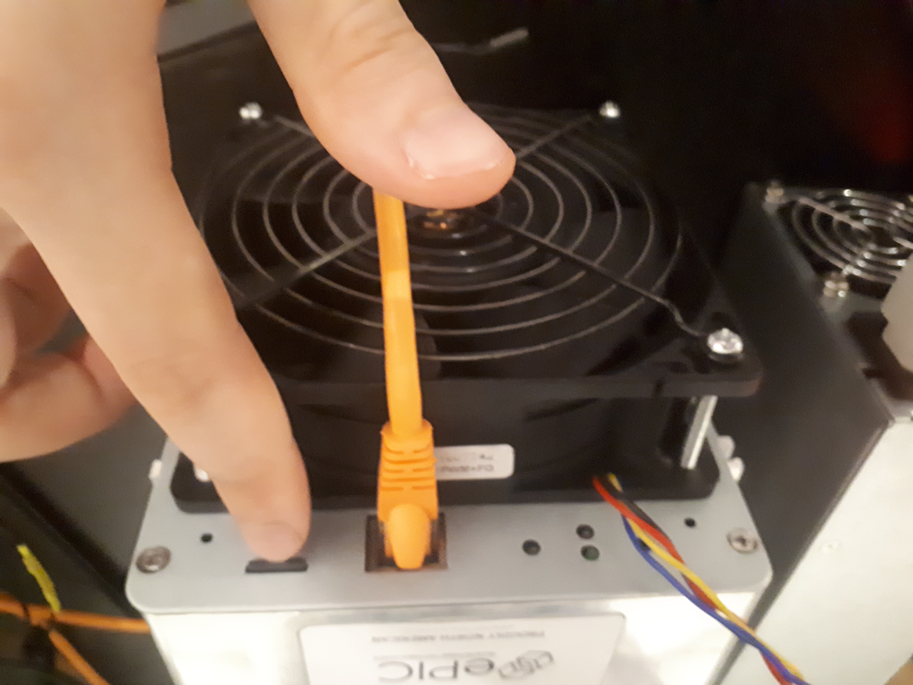
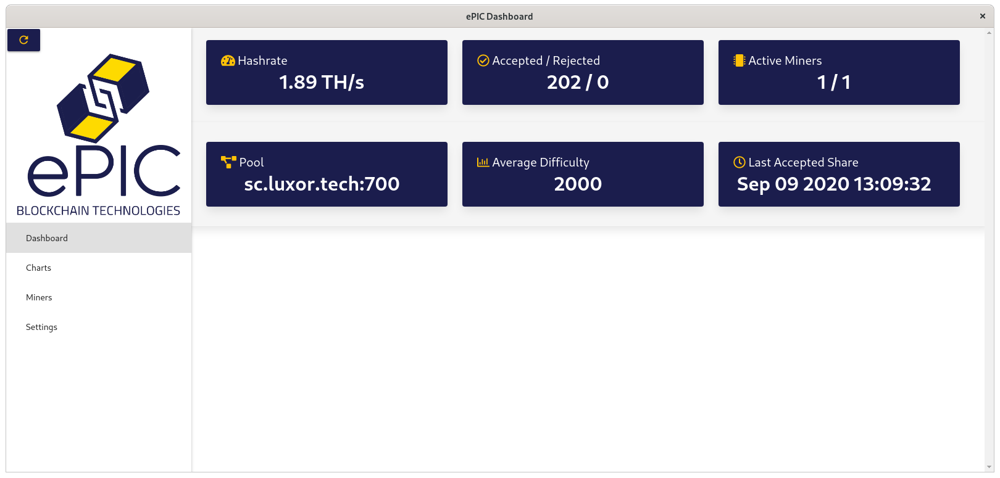
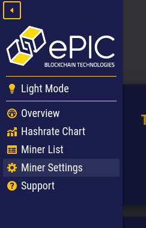
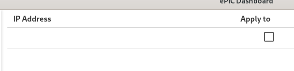
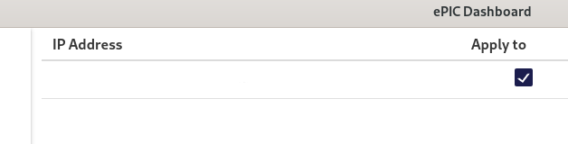

# ePIC-Miner

Please read EULA.md and PRIVACY.

# Required materials

## Included with ePIC miner

* ePIC miner
* SD card

## Not included with ePIC miner

* SD card to USB adapter
* Power supply
* Power cable
* Ethernet cable

# Installation guide

Download the miner image from the releases section on the sidebar to the right or from [here](https://github.com/epicblockchain/epic-miner/releases/).
The default password for the miner is "letmein". Please allow this miner to run on public and private networks if asked so that the software can identify miners on your network.

## Flashing a microSD card with ePIC image

Please note that the SD card included with the miner does not come pre-flashed. You must flash an image onto it using the instructions below for the miner to operate properly.

1. Download [balenaEtcher](https://www.balena.io/etcher/) for your machine.
2. Download compressed image (ePIC-SC200-vX.X.X-xxxxxxxxxx.zip)
3. Unzip the compressed image from the previous step. (ePIC-SC200-vX.X.X-xxxxxxxxxx.img)
4. Plug in microSD card into PC
5. Open the Etcher application (balenaEtcher).

6. Select Flash from file and choose the image file
7. Select target device
8. Click "Flash!" and wait for the process to finish.
9. Safely remove the SD card from the machine

## Inserting the SD card into the miner

1. Find the SD card slot for the miner.

2. Push the SD card into the slot until it clicks. It should have the gold coloured contacts facing up when inserted. The SD card may fall into the miner if the angle of insertion is wrong. Angle the SD card slightly up when inserting it. Wait for some resistance and then a click when pushing from the slot before releasing the chip.

## Connecting Cables

The power cable must be plugged in last.

### Fan cables

Plug in the fan cables. Face the front of the miner which has the ethernet port. The closest fan must connect to the left (when facing the miner) fan power port. The fan at the back of the miner must connect to the right (when facing the miner) fan power port.

### Ethernet cable

Plug in the ethernet cable from your network to the fan.

### Power cable

Plug in the power cable.

Note: the miner will not appear on the network for up to 15 minutes. It may restart several times as it find the optimal configuration to mine at.

## Updating individual miners

1. Click on settings.
2. Notice that on the left side of the settings is a table with all the miners on your local network.
3. Unchecking or checking the boxes to the right of their ip addresses will remove or add them (respectively) to the set of miners the settings will be applied to.

## Updating the wallet address

1. Download the [epic-dashboard](https://github.com/epicblockchain/epic-dashboard) for your OS from the releases section, or build it from source.
2. Run the executable and make sure it detects your miner on your local network.

3. Click on settings and set the wallet address to your own (address.workername). (Leave password as x)

4. Click apply and enter the default password of "letmein", the click apply.

## Updating the operating mode

1. Click on settings.
2. Use the dropdown menu under operating mode to select the desired operating mode. If you are running on 110V use efficiency only. The default operating mode is efficiency mode.

Note: The miner will reboot after this step. It will also recalibrate to fnd the optimal configuration to mine at for up to 15 min.

3. Click apply beside operating mode.
4. Click apply and enter the default password of "letmein", then click apply.
5. The miner will reboot now.

## Updating the mining pool
1. Click on settings.
2. Type the address of the mining pool in the Pool text field.

3. Click apply.
4. Enter the default password of "letmein" and click apply.

## Updating the password

1. Click on settings.
2. Type the new password in the new password text field.

3. Click apply.
4. Type the old password (which may be the default password "letmein").
5. Your password will have changed to the password you entered into the new text field. Use this instead of "letmein" from now on.

## Unique ID

Notice that the settings tab has a setting for a unique ID. If this value is set for a miner, the miner will have a unique ID added to its worker name which will be visible on the mining pool. By default this value is set.

# Things to know

* The typical process for the miner startup is to run the fan at high speed with a green light.
* The miner will flash the red and green LEDs back and forth very quickly while it calibrates.
* The miner may reboot several times on startup. This process can take up to 10 minutes.
* You will know the miner is hashing when it occasionally blinks green. Every green blink is a correct hash solution.
