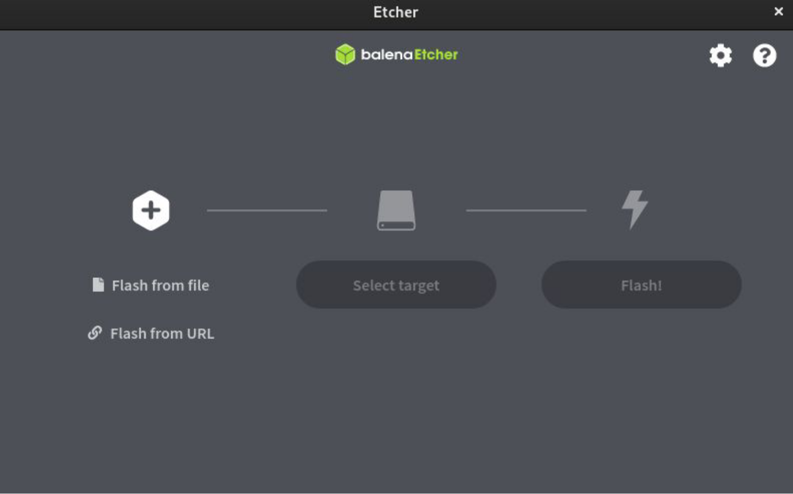

# ePIC-Miner

Please read EULA.md and PRIVACY.

Download the miner image from the releases section on the sidebar to the right or from [here](https://github.com/epicblockchain/epic-miner/releases/tag/1.0.0).

# Flashing an SD card

1. Download [balenaEtcher](https://www.balena.io/etcher/) for your machine.
2. Download compressed image (ePIC-SC200-vX.X.X-xxxxxxxxxx.zip)
3. Unzip image (ePIC-SC200-vX.X.X-xxxxxxxxxx.img)
4. Plug in microSD card into PC
5. Open the Etcher application

6. Select Flash from file and choose the image file
7. Select target device
8. Flash
9. Safely remove the SD card machine
